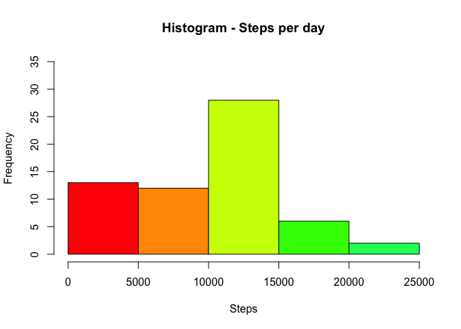
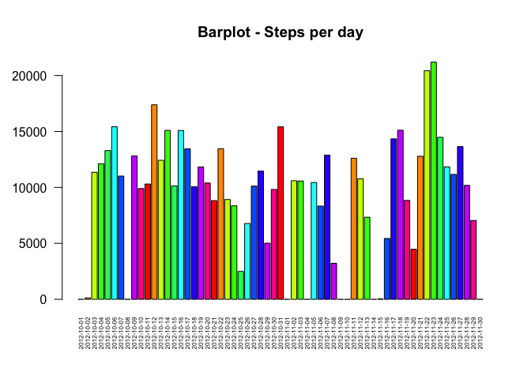
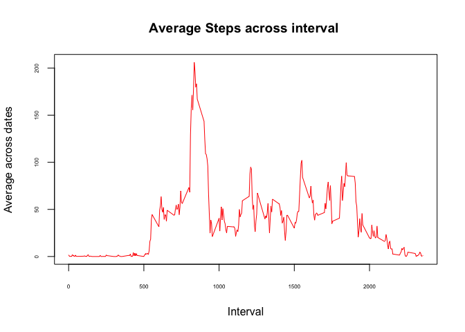
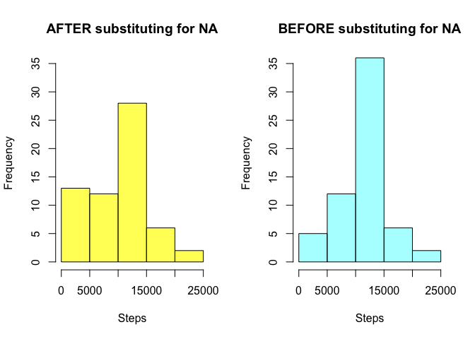

# Reproducible Research: Peer Assessment 1


## Loading and preprocessing the data


```r
library(data.table)

fileurl <- "https://d396qusza40orc.cloudfront.net/repdata%2Fdata%2Factivity.zip"
download.file(url=fileurl,destfile="activity.zip",method="curl")
unzip("./activity.zip")

activity1 <- read.csv("activity.csv",stringsAsFactors=FALSE)

activity <- data.table(activity1)

head(activity)
```

```
##    steps       date interval
## 1:    NA 2012-10-01        0
## 2:    NA 2012-10-01        5
## 3:    NA 2012-10-01       10
## 4:    NA 2012-10-01       15
## 5:    NA 2012-10-01       20
## 6:    NA 2012-10-01       25
```

## What is mean total number of steps taken per day?

**1. Calculate the total number of steps taken per day**

```r
library(dplyr)
```

```
## 
## Attaching package: 'dplyr'
## 
## The following objects are masked from 'package:data.table':
## 
##     between, last
## 
## The following objects are masked from 'package:stats':
## 
##     filter, lag
## 
## The following objects are masked from 'package:base':
## 
##     intersect, setdiff, setequal, union
```

```r
activity_per_day <- activity[ ,.(steps_per_day = sum(steps,na.rm=TRUE)),by=date]
head(activity_per_day,10)
```

```
##           date steps_per_day
##  1: 2012-10-01             0
##  2: 2012-10-02           126
##  3: 2012-10-03         11352
##  4: 2012-10-04         12116
##  5: 2012-10-05         13294
##  6: 2012-10-06         15420
##  7: 2012-10-07         11015
##  8: 2012-10-08             0
##  9: 2012-10-09         12811
## 10: 2012-10-10          9900
```


**2. If you do not understand the difference between a histogram and a barplot, research the difference between them. Make a histogram of the total number of steps taken each day**

```r
## Histogram for steps per day
hist(activity_per_day$steps_per_day, main = "Histogram - Steps per day", xlab = "Steps", col=rainbow(10), ylim=c(0,35))
```

 

```r
## Barplot for steps per day
barplot(activity_per_day$steps_per_day, names.arg = c(as.character(activity_per_day$date)), cex.axis=1, cex.names =0.5, las=2 , col=rainbow(10),main = "Barplot - Steps per day")
```

 


**3. Calculate and report the mean and median of the total number of steps taken per day**

```r
steps_per_day <- activity[ ,.(steps_per_day = sum(steps,na.rm=TRUE)),by=date]
avg_per_day <- activity[ ,.(avg_per_day = mean(steps,na.rm=TRUE)),by=date]
median_per_day <- activity[ ,.(median_per_day = as.double(median(steps,na.rm=TRUE))),by=date]

## Merging data table to get one single set of data. 
M1 <- merge(steps_per_day,avg_per_day,by="date")
activity_per_day1 <- merge(M1,median_per_day,by="date")
head(activity_per_day1)
```

```
##          date steps_per_day avg_per_day median_per_day
## 1: 2012-10-01             0         NaN             NA
## 2: 2012-10-02           126     0.43750              0
## 3: 2012-10-03         11352    39.41667              0
## 4: 2012-10-04         12116    42.06944              0
## 5: 2012-10-05         13294    46.15972              0
## 6: 2012-10-06         15420    53.54167              0
```

## What is the average daily activity pattern?

**1. Make a time series plot (i.e. type = "l") of the 5-minute interval (x-axis) and the average number of steps taken, averaged across all days (y-axis)**

```r
steps_per_interval <- activity[ ,.(steps_per_int = mean(steps,na.rm=TRUE)),by=interval]
head(steps_per_interval)
```

```
##    interval steps_per_int
## 1:        0     1.7169811
## 2:        5     0.3396226
## 3:       10     0.1320755
## 4:       15     0.1509434
## 5:       20     0.0754717
## 6:       25     2.0943396
```

```r
plot(steps_per_interval$interval,steps_per_interval$steps_per_int,type = "l",ylab = "Average across dates",xlab = "Interval", cex.axis=0.5,col=rainbow(10),main="Average Steps across interval ")
```

 


**2. Which 5-minute interval, on average across all the days in the dataset, contains the maximum number of steps?**

```r
steps_per_interval[steps_per_int == max(steps_per_interval$steps_per_int)]
```

```
##    interval steps_per_int
## 1:      835      206.1698
```

## Imputing missing values
**1. Calculate and report the total number of missing values in the dataset (i.e. the total number of rows with NAs)**

```r
activity3 <- merge(activity,steps_per_interval,by="interval")
nrow(activity3[ is.na(steps)])
```

```
## [1] 2304
```


**2. Devise a strategy for filling in all of the missing values in the dataset. The strategy does not need to be sophisticated. For example, you could use the mean/median for that day, or the mean for that 5-minute interval, etc.**

<i><span style="color:blue">The strategy I have used is to replace the 'NA' with the mean steps for that particualr interval across all days. Here is how its implemented in code:</span></i>

```r
head(activity3,10)
```

```
##     interval steps       date steps_per_int
##  1:        0    NA 2012-10-01      1.716981
##  2:        0     0 2012-10-02      1.716981
##  3:        0     0 2012-10-03      1.716981
##  4:        0    47 2012-10-04      1.716981
##  5:        0     0 2012-10-05      1.716981
##  6:        0     0 2012-10-06      1.716981
##  7:        0     0 2012-10-07      1.716981
##  8:        0    NA 2012-10-08      1.716981
##  9:        0     0 2012-10-09      1.716981
## 10:        0    34 2012-10-10      1.716981
```

```r
activity4 <- activity3[,lapply(.SD,function(steps){ifelse(is.na(steps),steps_per_int,steps)})]
```


**3. Create a new dataset that is equal to the original dataset but with the missing data filled in.**

```r
head(activity4)
```

```
##    interval     steps       date steps_per_int
## 1:        0  1.716981 2012-10-01      1.716981
## 2:        0  0.000000 2012-10-02      1.716981
## 3:        0  0.000000 2012-10-03      1.716981
## 4:        0 47.000000 2012-10-04      1.716981
## 5:        0  0.000000 2012-10-05      1.716981
## 6:        0  0.000000 2012-10-06      1.716981
```


**4. Make a histogram of the total number of steps taken each day and Calculate and report the mean and median total number of steps taken per day. Do these values differ from the estimates from the first part of the assignment? What is the impact of imputing missing data on the estimates of the total daily number of steps?**

```r
steps_per_day1 <- activity4[ ,.(steps_per_day = sum(steps,na.rm=TRUE)),by=date]
avg_per_day1 <- activity4[ ,.(avg_per_day = mean(steps,na.rm=TRUE)),by=date]
median_per_day1 <- activity4[ ,.(median_per_day = as.double(median(steps,na.rm=TRUE))),by=date]    

M2 <- merge(steps_per_day1,avg_per_day1,by="date")
activity_per_day2 <- merge(M2,median_per_day1,by="date")
head(activity_per_day2)
```

```
##          date steps_per_day avg_per_day median_per_day
## 1: 2012-10-01      10766.19    37.38260       34.11321
## 2: 2012-10-02        126.00     0.43750        0.00000
## 3: 2012-10-03      11352.00    39.41667        0.00000
## 4: 2012-10-04      12116.00    42.06944        0.00000
## 5: 2012-10-05      13294.00    46.15972        0.00000
## 6: 2012-10-06      15420.00    53.54167        0.00000
```

```r
par(mfcol = c(1,2))
hist(activity_per_day1$steps_per_day, main = "AFTER substituting for NA", ylim=c(0,35),xlab = "Steps", col=rgb(1,1,0,0.7))
hist(activity_per_day2$steps_per_day, ylim=c(0,35),  col=rgb(0,1,1,0.4), main = "BEFORE substituting for NA", xlab = "Steps")
```

 

<i><span style="color:blue">The frequency of steps between 0-5000 and 10000 - 15000  increased, rest of it is exactly similar.</span></i>


## Are there differences in activity patterns between weekdays and weekends?
